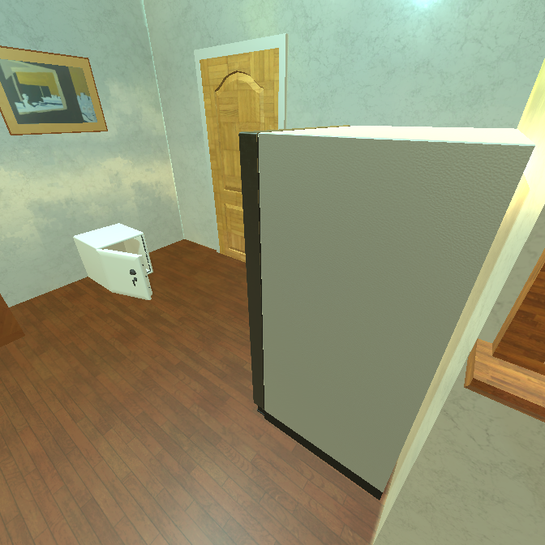
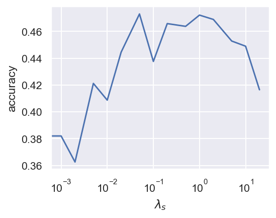

<p align="center"></p>

This repository is the official implementation of
<br>
**Causal Triplet: An Open Challenge for Intervention-centric Causal Representation Learning**
<br>
*<a href="https://proceedings.mlr.press/v177/">Conference on Causal Learning and Reasoning (CLeaR), 2023*
<br>
<a href="https://sites.google.com/view/yuejiangliu">Yuejiang Liu</a>,
<a href="https://people.epfl.ch/alexandre.alahi/?lang=en">Alexandre Alahi</a>
<a href="https://scholar.google.com/citations?user=RM2sHhYAAAAJ&hl=en">Chris Russell</a>,
<a href="https://expectationmax.github.io">Max Horn</a>,
<a href="https://is.mpg.de/person/dzietlow">Dominik Zietlow</a>,
<a href="https://is.mpg.de/~bs">Bernhard Schölkopf</a>,
<a href="https://www.francescolocatello.com">Francesco Locatello</a>

### Requirements

To install requirements:

```setup
pip install -r requirements.txt
```

### Dataset

To generate paired images from ProcTHOR:

```python
python procthor/generator.py --min_scene_idx=0 --max_scene_idx=9999
```

Examples of paired images, between which an 'open' action is performed:

 &nbsp; &nbsp;  &nbsp; &nbsp;  &nbsp; &nbsp; 

### Training

1. Single-object images under compositional distribution shifts

	To run the experiments encouraging independence between action class and object class:
	```bash
	bash script/run_comp_critic.sh
	```

	To run the experiments encouraging block-disentangled visual representations with the sparsity regularizer:
	```bash
	bash script/run_comp_sparse.sh
	```

2. Single-object images under systematic distribution shifts

	To run the experiments encouraging independence between action class and object class:
	```bash
	bash script/run_syst_critic.sh
	```

	To run the experiments encouraging block-disentangled visual representations with the sparsity regularizer:
	```bash
	bash script/run_syst_sparse.sh
	```

3. Simulated multi-object images under systematic distribution shifts

	To run the experiments approximating object-centric representations with instance masks:

	```bash
	bash script/run_instance_mask.sh
	```

	To run the experiments exploiting the latent structures in the Slot Attention with different matching modules:
	```bash
	bash script/run_slot_thor.sh
	```

4. Real-world multi-object images under compositional distribution shifts

	To run the experiments exploiting the latent structures in GroupVIT with different matching modules:
	```bash
	bash script/run_group_epic.sh
	```

### Analysis

To analyze experiment results:

```bash
bash script/run_analysis.sh
```

Examples of experiment results from the saved [logs](logs):

* Effect of block-disentanglement on single-object images under compositional distribution shifts (left: ID, right: OOD)

 

* Effect of approximate object-centric representations on simulated multi-object images (left: ID, right: OOD)

 

* Effect of exploiting group structures on real-world multi-object images (left: ID, right: OOD)

 

* Effect of exploiting slot structures on simulated multi-object images (left: ID, right: OOD)

 

* Visualization of implicit Slot Attention on simulated multi-object images \
(left to right: input pair, reconstructed pair, segmentation masks)


